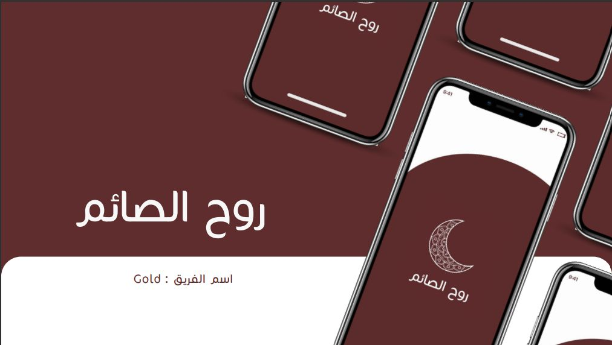
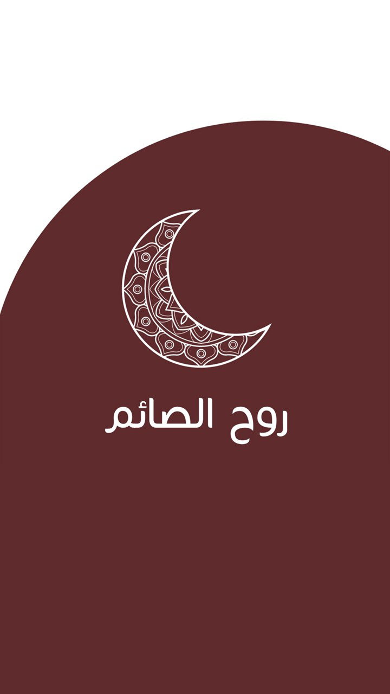
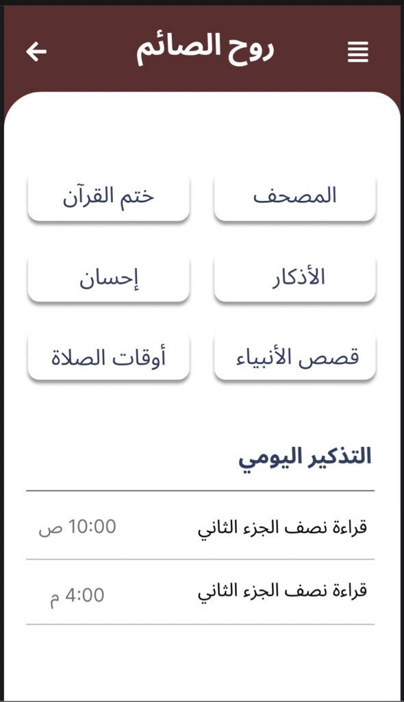
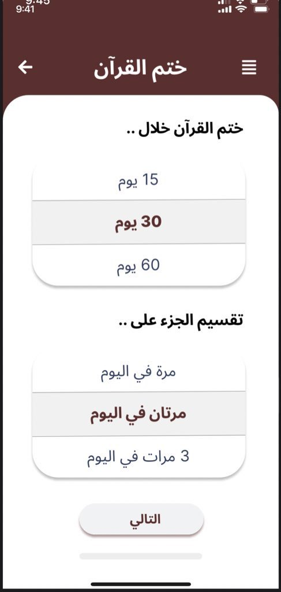
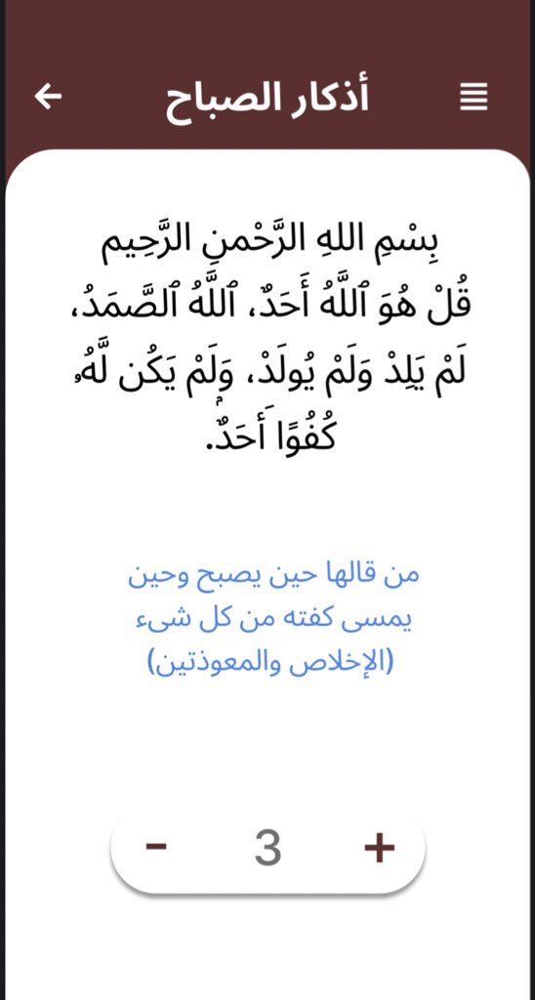

<b>تطبيق روح الصائم</b>

## Snapshots

| Splash Screen | home screen Screen                        |
|------|-------------------------------------------|
||  |

| Holy Quran Page                          | Duas  Page                                |
|------------------------------------------|----------------------------------------------|
|  |  |

## Team Members

### <a href="https://www.linkedin.com/in/sarah-alshaikhmohammed-ab20a9252/">- Sarah Alshaikhmohammed</a>
### <a href="https://www.linkedin.com/in/bashayer-alyami-74041922a/">- Bashayer Alyami</a> 
### <a href="https://www.linkedin.com/in/razan-sharaf-55084118b/">- Razan sharaf</a>
